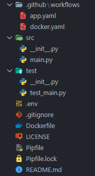
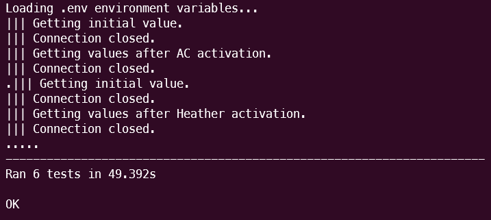
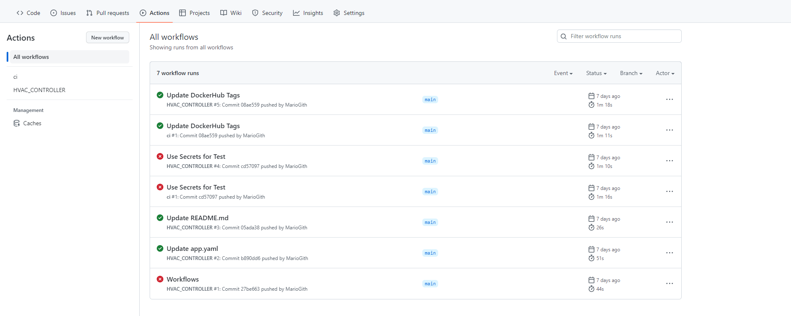
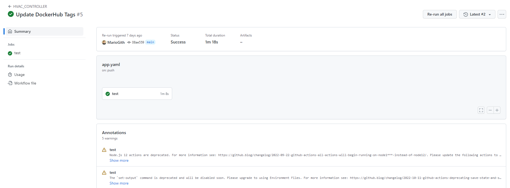
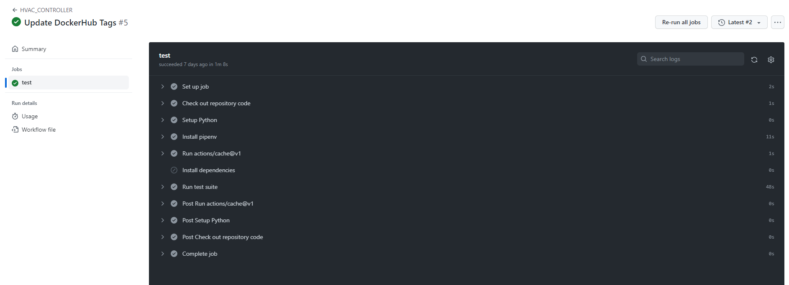

# WorkShop Cloud Campus DevOps

## Laboratoire 2 : Intégration continue et conteneurisation

Ce laboratoire a pour objectif de mettre en place un pipeline d’intégration continue et la conteneurisation d’une application.

### Mise en contexte

La compagnie Oxygène Software développe une solution logicielle, appelée Oxygène CS, qui permet le contrôle d’un système CVC/HVAC (heating, ventilation, air-conditioning).

Tel qu’illustré dans la figure ci-dessous, le contrôleur Oxygène CS se connecte à deux types de composants externes : un ensemble de senseurs qui fournissent diverses données, par exemple la température ambiante, et un système HVAC qui contient les équipements mécaniques permettant de chauffer, climatiser, ou ventiler une pièce. Le contrôleur reçoit la valeur des températures ambiantes (des senseurs) et envoie des commandes de contrôle au système HVAC pour maintenir la température de la pièce à une température désirée.

L’analyse du processus de développement existant d’Oxygène Software a permis d’identifier la phase d’intégration du logiciel comme étant la contrainte principale à l’amélioration du flux de valeur de développement du logiciel (First way).

Dans cette deuxième phase de votre projet, vous devez mettre en place le pipeline d'intégration continue (CI), incluant l’automatisation des tests et la conteneurisation (Docker) du logiciel, qui permettra de supporter le développement de l’application Oxygène CS.

Vous devrez aussi faire des modifications à l’application (Oxygène CS), incluant l’ajout de test unitaire, et exécuter le pipeline CI à la suite des modifications pour le tester/valider. L’image Docker produite par votre pipeline CI devra être disponible sur DockerHub.

En résumé, Oxygène Software vous demande d’implémenter le pipeline CI suivant (qui sera détaillé dans les Sections suivantes).

Pour tester l’application Oxygène CS, Oxygène Software a mis en ligne une application web qui permet le contrôle manuel des unités HVAC. De plus, elle a rendu disponible l’API qui doit être utilisée pour contrôler les unités et recevoir les données de température :

[Serveur HVAC](http://159.203.50.71)

---

### Ressources

Le lien ci-dessous fourni un ensemble de ressources (écrites et vidéos) utiles pour les laboratoires : _https://itsemi.notion.site/LOG-680-32bf411835ff4566991ff11d1762c2b3_

Si vous avez quelconques recommandations, merci d’en faire part au chargé de laboratoires qui les ajouteras.

Lien du Discord afin d’échanger avec le chargé de laboratoire : _https://discord.gg/vrK5x7Qr_

---

### Contenu

1. [Description du projet GitHub]()
2. [Le dossier _/src_]()
3. [Le dossier _/test_]()
4. [Fichiers restants]()
5. [Récupération du projet GitHub]()
6. [Lancement du projet controleur]()
7. [Test du projet controleur]()
8. [Description du pipeline]()
9. [Test du pipeline]()
10. [Conteneurisation de l’application]()
11. [Construction et déploiement de l’image Docker au sein du pipeline]()
12. [Test de l'image Docker distante]()

---

### 1. Description du projet HVAC-controller

Le projet du contrôleur HVAC est un petit serveur codé en **Python** et utilisant la librairire **SignalR** pour récupérer les données du [Serveur HVAC](_http://159.203.50.71_).

Le détail du code est le suivant, nous allons passer au travers rapidement pour comprendre son fonctionnement.



Le dossier **_.github_** contient l'ensemble du pipeline que nous allons décrire dans la suite du laboratoire.

---

### 2. Le dossier _/src_

Le dossier **/src** contient l'ensemble du code fonctionnel pour lancer le serveur.

Voici une ressource permettant de détailler l'utilité du fichier **init.py** : _https://careerkarma.com/blog/what-is-init-py/_

Pour ce qui est du code complet, on le retrouve dans le fichier **main.py**

```py
from signalrcore.hub_connection_builder import HubConnectionBuilder
import logging
import sys
import requests
import json
import time
import os
import mysql.connector as mysql

class Main:
    def __init__(self):
        self._hub_connection = None
        self.HOST = os.environ["HVAC_HOST"]
        self.TOKEN = os.environ["HVAC_TOKEN"]


    def __del__(self):
        if (self._hub_connection != None):
            self._hub_connection.stop()

    def setup(self):
        self.setSensorHub()

    def start(self):
        self.setup()
        self._hub_connection.start()

        print("Press CTRL+C to exit.")
        while True:
            time.sleep(2)

        self._hub_connection.stop()
        sys.exit(0)

    def setSensorHub(self):
        self._hub_connection = HubConnectionBuilder()\
        .with_url(f"{self.HOST}/SensorHub?token={self.TOKEN}")\
        .configure_logging(logging.INFO)\
        .with_automatic_reconnect({
            "type": "raw",
            "keep_alive_interval": 10,
            "reconnect_interval": 5,
            "max_attempts": 999
        }).build()

        self._hub_connection.on("ReceiveSensorData", self.onSensorDataReceived)
        self._hub_connection.on_open(lambda: print("||| Connection opened."))
        self._hub_connection.on_close(lambda: print("||| Connection closed."))
        self._hub_connection.on_error(lambda data: print(f"||| An exception was thrown closed: {data.error}"))

    def onSensorDataReceived(self, data):
        try:
            print(data[0]["date"]  + " --> " + data[0]["data"])
            date = data[0]["date"]
            dp = float(data[0]["data"])

            self.analyzeDatapoint(date, dp)
        except Exception as err:
            print(err)

    def analyzeDatapoint(self, date, data):
        if (data >= 80.0):
            self.sendActionToHvac(date, "TurnOnAc", 6)
        elif (data <= 20.0):
            self.sendActionToHvac(date, "TurnOnHeater", 6)

    def sendActionToHvac(self, date, action, nbTick):
        r = requests.get(f"{self.HOST}/api/hvac/{self.TOKEN}/{action}/{nbTick}")
        details = json.loads(r.text)
        print(details)

if __name__ == '__main__':
    main = Main()
    main.start()
```

Les premières lignes sont consacrées à l'import des bibliothèques nécessaires au bon fonctionnement du contrôleur :

```py
from signalrcore.hub_connection_builder import HubConnectionBuilder
import logging
import sys
import requests
import json
import time
import os
import mysql.connector as mysql
```

S'en suit un morceau de définition du projet et d'initialisation de l'application à l'aide des variables d'environnements :

```py
class Main:
    def __init__(self):
        self._hub_connection = None
        self.HOST = os.environ["HVAC_HOST"]
        self.TOKEN = os.environ["HVAC_TOKEN"]
```

Puis, nous avons les méthodes d'arrêts, de paramétrages et de lancement du projet :

```py
def __del__(self):
    if (self._hub_connection != None):
        self._hub_connection.stop()

def setup(self):
    self.setSensorHub()

def start(self):
    self.setup()
    self._hub_connection.start()

    print("Press CTRL+C to exit.")
    while True:
        time.sleep(2)

    self._hub_connection.stop()
    sys.exit(0)
```

La méthode suivante permet la paramétrage de la librairie signalR pour la récéption des informations :

```py
def setSensorHub(self):
    self._hub_connection = HubConnectionBuilder()\
    .with_url(f"{self.HOST}/SensorHub?token={self.TOKEN}")\
    .configure_logging(logging.INFO)\
    .with_automatic_reconnect({
        "type": "raw",
        "keep_alive_interval": 10,
        "reconnect_interval": 5,
        "max_attempts": 999
    }).build()

    self._hub_connection.on("ReceiveSensorData", self.onSensorDataReceived)
    self._hub_connection.on_open(lambda: print("||| Connection opened."))
    self._hub_connection.on_close(lambda: print("||| Connection closed."))
    self._hub_connection.on_error(lambda data: print(f"||| An exception was thrown closed: {data.error}"))

def onSensorDataReceived(self, data):
    try:
        print(data[0]["date"]  + " --> " + data[0]["data"])
        date = data[0]["date"]
        dp = float(data[0]["data"])
        self.analyzeDatapoint(date, dp)
    except Exception as err:
        print(err)
```

Enfin, la partie qui nous intéresse le plus, la partie effective du controleur. Ici, si température dépasse 60°, on allume la climatisation. Si elle descend sous les 20°, on allume le chauffage :

```py
def analyzeDatapoint(self, date, data):
    if (data >= 80.0):
        self.sendActionToHvac(date, "TurnOnAc", 6)
    elif (data <= 20.0):
        self.sendActionToHvac(date, "TurnOnHeater", 6)

def sendActionToHvac(self, date, action, nbTick):
    r = requests.get(f"{self.HOST}/api/hvac/{self.TOKEN}/{action}/{nbTick}")
    details = json.loads(r.text)
    print(details)
```

On termine avec une fonction interne à Python pour lancer le projet :

```py
if __name__ == '__main__':
    main = Main()
    main.start()
```

---

### 3. Le dossier _/test_

Le dossier **/test** contient l'ensemble du code permettant de tester l'application.

On y retrouve alors le fichier **test_main.py**

```py
import unittest
import sys
import logging
import requests
import json
import time
import os
import mysql.connector as mysql
from signalrcore.hub_connection_builder import HubConnectionBuilder
from src.main import Main

HOST = os.environ["HVAC_HOST"]
TOKEN = os.environ["HVAC_TOKEN"]
TICKETS = os.environ["HVAC_TICKETS"]

class TestStringMethods(unittest.TestCase):

    def test_simulator_up(self):
        r = requests.get(f"{HOST}/api/health")
        self.assertEqual("All system operational Commander !", r.text)

    def test_turn_off_unit(self):
        r = requests.get(f"{HOST}/api/HVAC/{TOKEN}/TurnOffHvac")
        res_payload_dict = r.json()
        self.assertEqual("Turning off Hvac", res_payload_dict['Response'])

    def test_turn_on_AC(self):
        r = requests.get(f"{HOST}/api/HVAC/{TOKEN}/TurnOnAc/{TICKETS}")
        res_payload_dict = r.json()
        self.assertEqual(f"Activating AC for {TICKETS} ticks", res_payload_dict['Response'])

    def test_turn_on_Heater(self):
        r = requests.get(f"{HOST}/api/HVAC/{TOKEN}/TurnOnHeater/{TICKETS}")
        res_payload_dict = r.json()
        self.assertEqual(f"Activating Heater for {TICKETS} ticks", res_payload_dict['Response'])


class TestHVACMethods(unittest.TestCase):
    def test_AC(self):
        self._hub_connection = HubConnectionBuilder()\
        .with_url(f"{HOST}/SensorHub?token={TOKEN}")\
        .configure_logging(logging.INFO)\
        .with_automatic_reconnect({
            "type": "raw",
            "keep_alive_interval": 10,
            "reconnect_interval": 5,
            "max_attempts": 2
        }).build()
        values = []
        self._hub_connection.on("ReceiveSensorData", lambda data: values.append(data[0]["data"]))
        self._hub_connection.on_open(lambda: print("||| Getting initial value."))
        self._hub_connection.on_close(lambda: print("||| Connection closed."))
        self._hub_connection.start()
        while len(values)<1:
            pass
        self._hub_connection.stop()
        r = requests.get(f"{HOST}/api/hvac/{TOKEN}/TurnOnAc/{TICKETS}")
        self._hub_connection.on_open(lambda: print("||| Getting values after AC activation."))
        self._hub_connection.start()
        while len(values)<5:
            pass
        self._hub_connection.stop()
        for i in range(len(values)-1):
            self.assertGreater(float(values[i]), float(values[i+1]))

    def test_Heater(self):
        self._hub_connection = HubConnectionBuilder()\
        .with_url(f"{HOST}/SensorHub?token={TOKEN}")\
        .configure_logging(logging.INFO)\
        .with_automatic_reconnect({
            "type": "raw",
            "keep_alive_interval": 10,
            "reconnect_interval": 5,
            "max_attempts": 2
        }).build()
        values = []
        self._hub_connection.on("ReceiveSensorData", lambda data: values.append(data[0]["data"]))
        self._hub_connection.on_open(lambda: print("||| Getting initial value."))
        self._hub_connection.on_close(lambda: print("||| Connection closed."))
        self._hub_connection.start()
        while len(values)<1:
            pass
        self._hub_connection.stop()
        r = requests.get(f"{HOST}/api/hvac/{TOKEN}/TurnOnHeater/{TICKETS}")
        self._hub_connection.on_open(lambda: print("||| Getting values after Heather activation."))
        self._hub_connection.start()
        while len(values)<5:
            pass
        self._hub_connection.stop()
        for i in range(len(values)-1):
            self.assertLess(float(values[i]), float(values[i+1]))

if __name__ == '__main__':
    unittest.main()
```

Si nous nous intéressons uniquement aux parties de test, nous y retrouver 2 types de tests : Les tests de réponse du serveur HVAC (**_TestStringMethods_**) et les tests de fonctionnement du controleur HVAC (**_TestHVACMethods_**). Ces derniers vont tester le fonctionnement de la climatisation et du chauffage pendant un nombre de tickets définies au sein des variables d'environnements (**_TICKETS = os.environ["HVAC_TICKETS"]_**).

---

### 4. Fichiers restants

Le fichier **.env** regroupe les variables d'environnements nécessaires au bon fonctionnement du projet :

```
HVAC_HOST=http://159.203.50.71
HVAC_TOKEN={YOUR_TOKEN}
HVAC_TICKETS=6
T_MAX=60
T_MIN=20
```

Le fichier **.gitignore** regroupe l'ensemble des dossiers/fichiers qui doivent être ignorée par le versionnage de git :

```
# Byte-compiled / optimized / DLL files
__pycache__/
*.py[cod]
*$py.class

# C extensions
*.so

# Distribution / packaging
.Python
build/
develop-eggs/
dist/
downloads/
eggs/
.eggs/
lib/
lib64/
parts/
sdist/
var/
wheels/
pip-wheel-metadata/
share/python-wheels/
*.egg-info/
.installed.cfg
*.egg
MANIFEST

# PyInstaller
#  Usually these files are written by a python script from a template
#  before PyInstaller builds the exe, so as to inject date/other infos into it.
*.manifest
*.spec

# Installer logs
pip-log.txt
pip-delete-this-directory.txt

# Unit test / coverage reports
htmlcov/
.tox/
.nox/
.coverage
.coverage.*
.cache
nosetests.xml
coverage.xml
*.cover
*.py,cover
.hypothesis/
.pytest_cache/

# Translations
*.mo
*.pot

# Django stuff:
*.log
local_settings.py
db.sqlite3
db.sqlite3-journal

# Flask stuff:
instance/
.webassets-cache

# Scrapy stuff:
.scrapy

# Sphinx documentation
docs/_build/

# PyBuilder
target/

# Jupyter Notebook
.ipynb_checkpoints

# IPython
profile_default/
ipython_config.py

# pyenv
.python-version

# pipenv
#   According to pypa/pipenv#598, it is recommended to include Pipfile.lock in version control.
#   However, in case of collaboration, if having platform-specific dependencies or dependencies
#   having no cross-platform support, pipenv may install dependencies that don't work, or not
#   install all needed dependencies.
#Pipfile.lock

# PEP 582; used by e.g. github.com/David-OConnor/pyflow
__pypackages__/

# Celery stuff
celerybeat-schedule
celerybeat.pid

# SageMath parsed files
*.sage.py

# Environments
.env
.venv
env/
venv/
ENV/
env.bak/
venv.bak/

# Spyder project settings
.spyderproject
.spyproject

# Rope project settings
.ropeproject

# mkdocs documentation
/site

# mypy
.mypy_cache/
.dmypy.json
dmypy.json

# Pyre type checker
.pyre/

# vsCode
.vscode/*

# SSH Key
deploy_rsa
deploy_rsa.pub
```

Le fichier **Dockerfile** permet la conteneurisation du projet en une image Docker :

```docker
FROM python:3.8-slim as base

# Setup env
ENV LANG C.UTF-8
ENV LC_ALL C.UTF-8
ENV PYTHONDONTWRITEBYTECODE 1
ENV PYTHONFAULTHANDLER 1


FROM base AS python-deps

# Install pipenv and compilation dependencies
RUN pip install pipenv
RUN apt-get update && apt-get install -y --no-install-recommends gcc

# Install python dependencies in /.venv
COPY Pipfile .
COPY Pipfile.lock .
RUN PIPENV_VENV_IN_PROJECT=1 pipenv install --deploy


FROM base AS runtime

# Copy virtual env from python-deps stage
COPY --from=python-deps /.venv /.venv
ENV PATH="/.venv/bin:$PATH"

# Create and switch to a new user
RUN useradd --create-home appuser
WORKDIR /home/appuser
USER appuser

# Install application into container
COPY . .

# Run the application
ENTRYPOINT ["python3", "src/main.py"]
```

Le fichier **LICENSE** permet de déclarer une licence d'utilisation du projet (ici MIT).

Le fichier **Pipfile** permet de créer un environnement virtuel pour simplifier l'utilisation du projet et de ses dépendances :

```
[[source]]
url = "https://pypi.org/simple"
verify_ssl = true
name = "pypi"

[packages]
certifi = "==2021.5.30"
chardet = "==4.0.0"
idna = "==2.10"
msgpack = "==1.0.2"
"mysql.connector" = "==2.2.9"
requests = "==2.25.1"
signalrcore = "==0.9.2"
six = "==1.16.0"
urllib3 = "==1.26.5"
websocket-client = "==0.54.0"
pylint = "*"
kubernetes = "*"

[dev-packages]

[requires]
python_version = "3.8"

[scripts]
test = "python -m unittest"
lint = "pylint src test"
start = "python src/main.py"
k8s = "python k8s/setup_k8s.py"
```

Le fichier **Pipfile.lock** permet de l'installation des dépendances du projet.

Le fichier **README.md** permet de décrire l'utilisation du projet.

---

### 5. Récupération du projet sur GitHub

Comme expliqué dans la mise en contexte, nous allons utiliser un projet simulant un contrôleur d'une unité HVAC.

Afin de cloner ce projet, nous allons utiliser une fonctionnalité différente de celle présentée dans le Lab 1. Cette fois-ci, nous allons "Forker" le repository.

Pour ce faire, rendez-vous au lien suivant : _https://github.com/MarioGith/hvac-control-pipeline_

Puis, il va vous falloir cliquer sur le bouton de Fork :


Renommez le projet comme vous le souhaitez et cliquez sur le bouton "Create Fork" ci dessous :


Vous venez donc de cloner le repository du contrôleur HVAC. Il faut maintenant venir le télécharger en local.

> Puisque ce repository a été **forké**, il ne sera pas nécessaire de suivre la méthodologie de suppression du .git, car ce clone possède déjà vos informations propres de git.

Placez-vous dans le dossier où vous souhaitez y stocker le projet en local et ouvrez un terminal (**ATTENTION** : Le dossier sélectionné doit se situer en dehors du projet metricstemi pour ne pas créer de problème de fonctionnement entre les deux applications).

Allez récupérer le lien de clonage du projet grâce au bouton suivant :


Puis, copiez la ligne de commande suivante en y insérant le lien copier à l'étape précédente à la place du _{YOUR_LINK}_ :

```bash
git clone {YOUR_LINK}
```

---

### 6. Lancement du projet controleur

Pour lancer le projet, nous allons nous servir de la bibliothèque _pipenv_ et du fichier _Pipfile_.

Pour commencer, il est important de se déplacer avec le terminal dans le projet que vous avez cloné :

```bash
cd {YOUR_PROJECT}
```

Ensuite, il va être nécessaire d'installer les dépendances du projet :

```bash
pipenv install
```

Maintenant, il va falloir créer un fichier d'environnement comme vu précedemment. Pour simplifier la tâche, il vous suffit de renommer le fichier d'environnement _.envexemple_ en _.env_ et d'y ajouter votre token personnel à l'intérieur à la place de _{YOUR_TOKEN}_ :

```
HVAC_HOST=http://159.203.50.71
HVAC_TOKEN={YOUR_TOKEN}
HVAC_TICKETS=6
T_MAX=60
T_MIN=20
```

Il ne reste plus qu'à lancer le projet avec la commande :

```bash
pipenv run start
```

Normalement, le terminal devrait faire apparaître le message suivant, avec des valeurs différentes de températures :


Votre projet est donc fonctionnel !

---

### 7. Test du projet controleur

Pour lancer les tests du projet, il suffit de lancer la commande :

```bash
pipenv run test
```

Si les tests sont fonctionnels, vous verrez les messages suivants apparaître :



---

### 8. Description du pipeline

Comme expliqué dans la partie 1, le pipeline se trouve dans le dossier **./github/workflows**.

Nous avons ici 2 pipelines qui se lancent, mais nous verrons d'abord, le premier, se trouvant dans le fichier **app.yaml** :

```yaml
# .github/workflows/app.yaml
name: HVAC_CONTROLLER
on: push

jobs:
  test:
    runs-on: ubuntu-latest
    timeout-minutes: 10

    steps:
      - name: Check out repository code
        uses: actions/checkout@v2

      # Setup Python (faster than using Python container)
      - name: Setup Python
        uses: actions/setup-python@v2
        with:
          python-version: "3.7"

      - name: Install pipenv
        run: |
          python -m pip install --upgrade pipenv wheel

      - id: cache-pipenv
        uses: actions/cache@v1
        with:
          path: ~/.local/share/virtualenvs
          key: ${{ runner.os }}-pipenv-${{ hashFiles('**/Pipfile.lock') }}

      - name: Install dependencies
        if: steps.cache-pipenv.outputs.cache-hit != 'true'
        run: |
          pipenv install --deploy --dev

      - name: Run test suite
        run: |
          pipenv run test
        env:
          HVAC_HOST: ${{ secrets.HVAC_HOST }}
          HVAC_TOKEN: ${{ secrets.HVAC_TOKEN }}
          HVAC_TICKETS: ${{ secrets.HVAC_TICKETS }}
          T_MAX: 60
          T_MIN: 20
```

Ce dernier décrit les étapes de notre pipeline de test de l'application, de son build à son analyse statique en passant par la suite de tests présentée dans le point 4. Il porte le nom de HVAC_CONTROLLER.

Le nom des "steps" étant assez explicite, vous comprendrez facilement la fonction de chacune.

Ce dernier va être roulé à chaque **_git push_** effectué sur le repository distant hébergé par GitHub.

Cependant, puisque nous ne déposons pas notre fichier d'environnement sur le repository GitHub, il est nécessaire de venir entrer ces valeurs dans l'environnement GitHub.

Ici, ce n'est pas un fichier **.env**, mais des **_secrets_**.

Pour les entrer, il faut se rendre dans l'onglet **Settings** du repository GitHub, puis dans l'onglet Secrets et Actions :


Il suffit alors d'ajouter un nouveau secret avec le bouton et les étapes suivantes :


Et cela avec **HVAC_TOKEN** et **HVAC_TICKETS**.

Pour revenir au Workflows, en se rendant sur la page du repository dans l'onglet "Actions" on peut voir l'historique du lancement de ces pipelines :



Les états de passage sont symbolisés par les croix rouges (le pipeline a échoué) et le symbole de validation vert (le pipeline fonctionne). Les titres des essais correspondent au nom du commit qui lui est associé. En termes de métriques, on retrouve sur la droite d'un essai la date et le temps d'exécution du pipeline.

En cliquant sur une tentative de passage du pipeline, on peut voir des détails sur son exécution :



Enfin, en cliquant sur un Job (ici test), on peut y voir led détails et les logs des différents Steps :



Ces logs peuvent nous aider à comprendre à quelle étape un pipeline aurait pu échouer.

---

### 9. Test du pipeline

Pour tester le fonctionnement de notre pipeline, nous allons retourner sur VSCode et effectuer une modification sur notre code dans ce fichier-ci.

Merci d'ajouter un x dans la case suivante [ ] :

```
[] J'ai complété l'étape de test du pipeline
```

Par la suite, nous allons effectuer la suite de commandes pour pousser notre code sur le repository distant :

```bash
git add *
```

```bash
git commit -m "Complete pipeline test"
```

```bash
git push
```

Ensuite, rendez-vous sur l'onglet "Actions" de votre repository GitHub pour y voir le pipeline se rouler !

---

### 10. Conteneurisation de l’application

Afin de simplifier l'intégration continue, nous avons décidé d'utiliser la technologie Docker pour conteneuriser notre application.

Cette étape requière la création d'un fichier **Dockerfile** que nous avons déjà créé pour vous.

Il ne vous reste plus qu'à lancer le logiciel Docker Desktop sur votre machine, et de lancer dans votre terminal la commande suivante :

```bash
docker build . --tag {YOUR_NAME}/hvac-controller
```

Vous venez de créer votre image Docker du projet, il faut maintenant la tester en local avec la commande :

```bash
docker run -d --name hvac-controller --env-file ./.env {YOUR_NAME}/hvac-controller
```

Pour vérifier son fonctionnement, ouvrez votre instance de Docker Desktop dans l'onglet **Containers** puis ouvrez le container nommé **hvac-controller** pour y voir les logs.

Votre application est donc fonctionnelle !

---

### 11. Construction et déploiement de l’image Docker au sein du pipeline

Nous allons maintenant nous intéresser au deuxième pipeline qui fait partie du dossier **.github/workflows/**.

Dans ce dernier, nous retrouvons le fichier **docker.yaml**:

```yaml
name: ci

on:
  push:
    branches:
      - "main"

jobs:
  docker:
    runs-on: ubuntu-latest
    steps:
      - name: Set up QEMU
        uses: docker/setup-qemu-action@v2
      - name: Set up Docker Buildx
        uses: docker/setup-buildx-action@v2
      - name: Login to Docker Hub
        uses: docker/login-action@v2
        with:
          username: ${{ secrets.DOCKERHUB_USERNAME }}
          password: ${{ secrets.DOCKERHUB_TOKEN }}
      - name: Build and push
        uses: docker/build-push-action@v3
        with:
          push: true
          tags: ${{ secrets.DOCKERHUB_USERNAME }}/hvac-pipeline:latest
```

On y retrouve ici les steps permettant le build de l'image Docker et son déploiement sur le Docker Hub (pour être utilisée par tous).

Pour que ce pipeline soit fonctionnel, il est nécessaire d'ajouter les secrets : **DOCKERHUB_USERNAME** et **DOCKERHUB_TOKEN** (créée dans les prérequis) tel que décrit dans la partie 5.

Pour tester le fonctionnement de notre pipeline, nous allons retourner sur VSCode et effectuer une modification sur notre code dans ce fichier-ci.

Merci d'ajouter un x dans la case suivante [ ] :

```
[] J'ai complété l'étape d'intégration continue du pipeline
```

Par la suite, nous allons effectuer la suite de commandes pour pousser notre code sur le repository distant :

```bash
git add *
```

```bash
git commit -m "Complete pipeline ci"
```

```bash
git push
```

---

### 12. Test de l'image Docker distante

Pour tester l'image que vous venez de créer, il vous suffit d'ouvrir un terminal dans le répertoire du projet et de lancer la commande :

```bash
docker run -d --name hvac-controller --env-file ./.env {DOCKERHUB_USERNAME}/hvac-controller:latest
```
