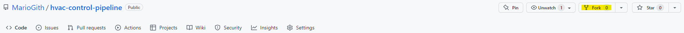
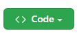
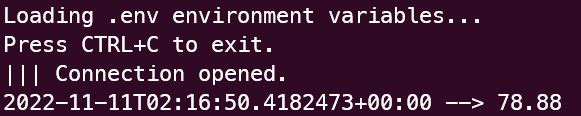
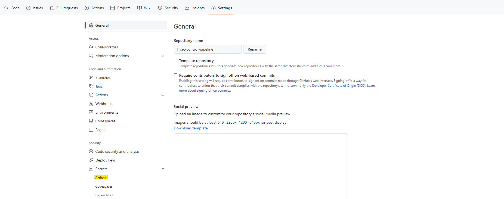
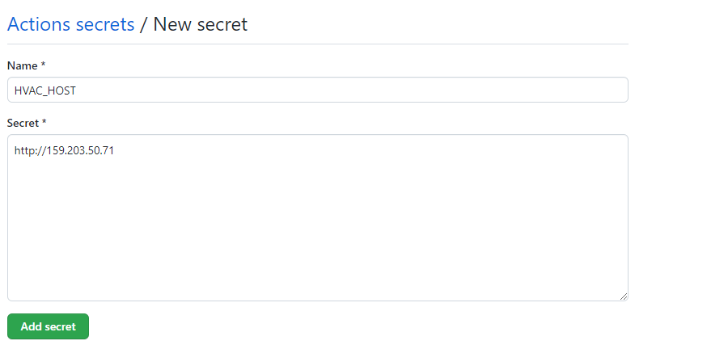

# WorkShop Cloud Campus DevOps

## Laboratoire 3 : Déploiement continu

Ce laboratoire a pour objectif de finaliser la mise en place d’un pipeline d’intégration et son déploiement continue.

### Mise en contexte

La compagnie Oxygène Software possède des unités de HVAC (heating, ventilation, air conditioning). Un HVAC est un système de chauffage, ventilation et d’air climatisé. Ces unités n’ont pas de contrôleur intelligent. La compagnie vous demande de développer un contrôleur pour contrôler les unités HVAC pour garder une température raisonnable.

Oxygène Software a mis en ligne une application web qui permet le contrôle manuel des unités HVAC. De plus, elle a rendu disponible l’API qui doit être utilisée pour contrôler les unités. http://159.203.50.71/sensor

Oxygène Software a mis en place un cluster Kubernetes pour le déploiement d'applicationsen production. Votre équipe recevra un fichier de configuration pour accéder au namespace qui vous est assigné dans le cluster.

---

### Ressources

Le lien ci-dessous fourni un ensemble de ressources (écrites et vidéos) utiles pour les laboratoires : _https://itsemi.notion.site/LOG-680-32bf411835ff4566991ff11d1762c2b3_

Si vous avez quelconques recommandations, merci d’en faire part au chargé de laboratoires qui les ajouteras.

Lien du Discord afin d’échanger avec le chargé de laboratoire : _https://discord.gg/vrK5x7Qr_

---

### Contenu

0. [Prérequis]()
1. [Configuration Kubernetes]()
2. [Création de la ConfigMap]()
3. [Création des Secrets]()
4. [Déploiement sur votre Namespace]()
5. [Automatisation local]()

---

### 0. Prérequis

Une base provennant du Lab 2 est requise pour effectuer ce Lab 3, en voici les différentes étapes :

### 0.1. Récupération du projet sur GitHub

Comme expliqué dans la mise en contexte, nous allons utiliser un projet simulant un contrôleur d'une unité HVAC.

Afin de cloner ce projet, nous allons utiliser une fonctionnalité différente de celle présentée dans le Lab 1. Cette fois-ci, nous allons "Forker" le repository.

Pour ce faire, rendez-vous au lien suivant : _https://github.com/MarioGith/hvac-control-pipeline_

Puis, il va vous falloir cliquer sur le bouton de Fork :



Renommez le projet comme vous le souhaitez et cliquez sur le bouton "Create Fork" ci dessous :


Vous venez donc de cloner le repository du contrôleur HVAC. Il faut maintenant venir le télécharger en local.

> Puisque ce repository a été **forké**, il ne sera pas nécessaire de suivre la méthodologie de suppression du .git, car ce clone possède déjà vos informations propres de git.

Placez-vous dans le dossier où vous souhaitez y stocker le projet en local et ouvrez un terminal (**ATTENTION** : Le dossier sélectionné doit se situer en dehors du projet metricstemi pour ne pas créer de problème de fonctionnement entre les deux applications).

Allez récupérer le lien de clonage du projet grâce au bouton suivant :



Puis, copiez la ligne de commande suivante en y insérant le lien copier à l'étape précédente à la place du _{YOUR_LINK}_ :

```bash
git clone {YOUR_LINK}
```

### 0.2. Lancement du projet controleur

Pour lancer le projet, nous allons nous servir de la bibliothèque _pipenv_ et du fichier _Pipfile_.

Pour commencer, il est important de se déplacer avec le terminal dans le projet que vous avez cloné :

```bash
cd {YOUR_PROJECT}
```

Ensuite, il va être nécessaire d'installer les dépendances du projet :

```bash
pipenv install
```

Maintenant, il va falloir créer un fichier d'environnement comme vu précedemment. Pour simplifier la tâche, il vous suffit de renommer le fichier d'environnement _.envexemple_ en _.env_ et d'y ajouter votre token personnel à l'intérieur à la place de _{YOUR_TOKEN}_ :

```env
HVAC_HOST=http://159.203.50.71
HVAC_TOKEN={YOUR_TOKEN}
HVAC_TICKETS=6
T_MAX=60
T_MIN=20
```

Il ne reste plus qu'à lancer le projet avec la commande :

```bash
pipenv run start
```

Normalement, le terminal devrait faire apparaître le message suivant, avec des valeurs différentes de températures :



Votre projet est donc fonctionnel !

### 0.3. Parametrage du repository

Ici, ce n'est pas un fichier **.env**, mais des **_secrets_**.

Pour les entrer, il faut se rendre dans l'onglet **Settings** du repository GitHub, puis dans l'onglet Secrets et Actions :



Il suffit alors d'ajouter un nouveau secret avec le bouton et les étapes suivantes :




Et cela avec **HVAC_TOKEN**, **HVAC_TICKETS**, **HVAC_HOST**, **T_MAX**, **T_MIN**, **DOCKERHUB_USERNAME** et **DOCKERHUB_TOKEN**.

---

### 1. Configuration Kubernetes

Au sein de ce projet, nous y retrouvons un dossier _/k8s_. Ce dernier comprend l'ensemble des scripts de base nécessaire au déploiement d'un projet sur un cluster Kubernetes.

On y retrouve un dossier _/template_ qui contient des fichiers de configuration pour la création des entités suivantes :

- [ConfigMap](/k8s/templates/config-map.yaml)
- [Secrets](/k8s/templates/secrets.yaml)
- [Deployment](/k8s/templates/deploy.yaml)

De plus, on y retrouve un fichier de configuration nécessaire à l'utilisation des commandes **kubectl** : [KubeConfig](/k8s/templates/kubeconfig.yaml). Ce dernier n'est pas à éditer, il est fourni par votre hébergeur Kubernetes.

Dans le cadre de ce workshop, nous avons simplifié la démarche en automatisant ce processus de création des ressources par un module python : [setup_k8s.py](/k8s/setup_k8s.py)

Les partie 2., 3. et 4. vont permettre de visualiser le processus de création de ces ressources hors automatisation.
Si vous souhaitez utiliser l'automatisation proposée, merci de passer directement à la partie 5.

---

### 2. Création des ConfigMaps

Lien vers la documentation des ConfigMaps : https://kubernetes.io/docs/concepts/configuration/configmap/.

Le fichier [config-map.yaml](/k8s/templates/config-map.yaml) se présente comme suit :

```yaml
apiVersion: v1
kind: ConfigMap
metadata:
  name: hvac-env
data:
  HVAC_HOST: host
  HVAC_TICKETS: tickets
  T_MAX: t_max
  T_MIN: t_min
```

Il est équivalent au fichier _.env_ que nous utilisons pour les variables d'environnements en local et au _secrets_ GitHub. Son but ici est de stocker les variables d'environnements sur le cluster Kubernetes afin de pouvoir y accéder lors des déploiements sur le notre plateforme infonuagique.

Ce fichier, une fois édité avec les valeurs souhaitées de {HVAC_HOST}, {HVAC_TICKETS}, {T_MAX} et {T_MIN}, peut être appliquées par la commande suivante :

```bash
kubectl apply -f ./templates/config-map.yaml --kubeconfig=./templates/kubeconfig.yaml
```

---

### 3. Création des Secrets

Lien vers la documentation des Secrets : https://kubernetes.io/docs/concepts/configuration/secret/

Le fichier [secrets.yaml](/k8s/templates/secrets.yaml) se présente comme suit :

```yaml
apiVersion: v1
kind: Secret
metadata:
  name: hvac-secret
type: Opaque
data:
  HVAC_TOKEN: token
```

Il est équivalent au _ConfigMap_ mais se distingue par son critère de sensibilité. Ce type d'information ne doit donc jamais être écrit en plaintext dans votre code et déposé sur vos repositories distants.

Ce fichier, une fois édité peut être appliquées par la commande suivante :

```bash
kubectl apply -f ./templates/secrets.yaml --kubeconfig=./templates/kubeconfig.yaml
```

---

### 4. Déploiement sur votre Namespace

Lien de la documentation des Deployments : https://kubernetes.io/docs/concepts/workloads/controllers/deployment/

Le fichier [deploy.yaml](/k8s/templates/deploy.yaml) se présente comme suit :

```yaml
apiVersion: apps/v1
kind: Deployment
metadata:
  name: hvac-deployment
  labels:
    app: hvac
spec:
  replicas: 1
  selector:
    matchLabels:
      app: hvac
  template:
    metadata:
      labels:
        app: hvac
    spec:
      containers:
        - name: hvac
          image: itsemi/hvac-controleler:latest
          envFrom:
            - configMapRef:
                name: hvac-env
            - configMapRef:
                name: hvac-secrets
          resources:
            limits:
              cpu: 100m
              memory: 64Mi
            requests:
              cpu: 75m
              memory: 64Mi
```

Ony retrouve les informations nécessaires pour le déploiement de notre application sur le cluster Kubernetes.

Cependant, si vous ne souhaitez pas utiliser la version proposée par le laboratoire mais la version qui est produite par votre propre pipeline du Lab 2, vous pouvez éditer ce fichier en faisant la modification de :

```yaml
image: itsemi/hvac-controleler:latest
```

en

```yaml
image: { votre image }
```

Ce fichier, une fois édité peut être appliquées par la commande suivante :

```bash
kubectl apply -f ./templates/deploy.yaml --kubeconfig=./templates/kubeconfig.yaml
```

---

### 5. Automatisation local

Pour palier au problème de sécurité et pour faciliter la mise en place des processus, un module a été créé : [setup_k8s.py](/k8s/setup_k8s.py).

Ce dernier peut être appelé par le script suivant en y entrant vos informations dans les {...}:

```bash
pipenv run k8s -n {YOUR_NAMESPACE} -c {PATH_TO_CONFIG_FILE} -d {DOCKERHUB_IMAGE}
```
