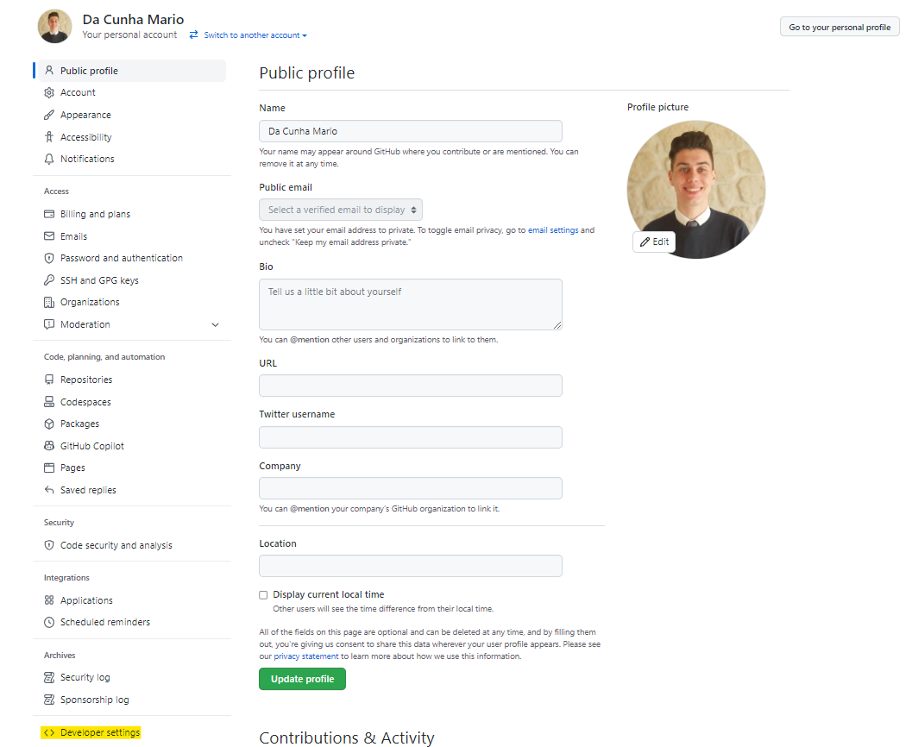
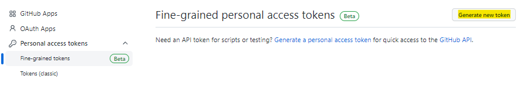
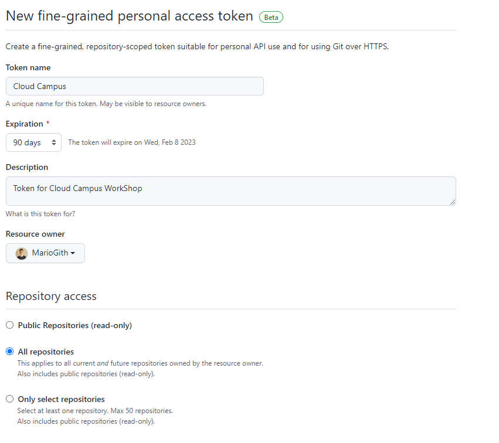
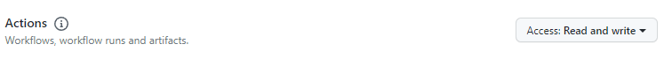
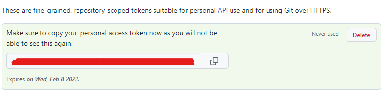
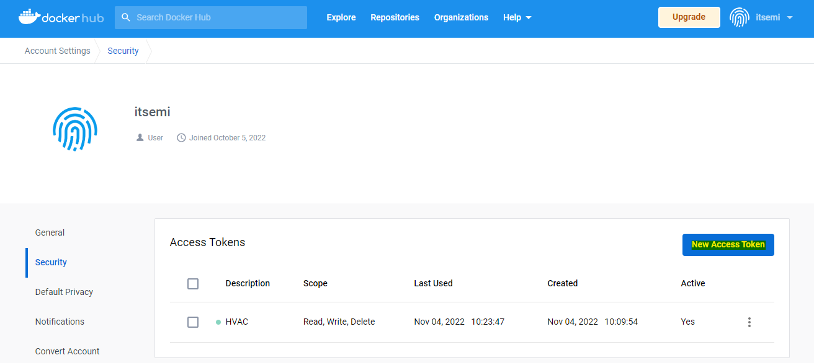
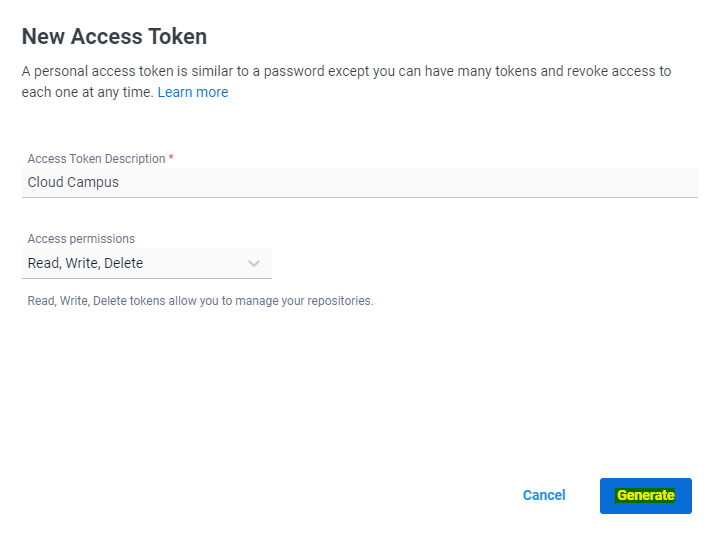
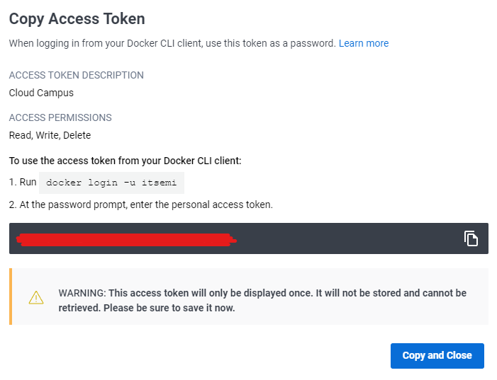

# WorkShop Cloud Campus DevOps

## Prérequis

### Liste

Afin de faire tourner les projets et de travailler sur vos machines, vous allez avoir besoin des configurations suivantes :

- [Une mise à jour de votre WSL (Windows Subsystem for Linux vers la version 2)](#Mise-à-jour-de-votre-WSL)
- [Une installation de Git](#Installation-de-Git)
- [Une installation de Node JS](#Installation-de-Node-JS)
- [Une installation de Docker Desktop](#Installation-de-Docker-Desktop)
- [Une installation de Python](#Installation-de-Python)
- [Une installation de Kube Control](#Installation-de-kubectl)
- [Une installation des bibliothèques pipenv](#Installation-de-la-bibliothèque-Pipenv)
- [Un éditeur de code de votre choix](#Un-éditeur-de-code)

> À noter : Si vous participez au WorkShop depuis les machines/images mises à disposition, l'ensemble des configurations auront été faites au préalable

Afin de réaliser ces laboratoires, vous allez avoir besoin de plusieurs ressources qui sont listées ci dessous :

- [Un compte GitHub](#Création-d'un-compte-GitHub)
- [Un token de connexion à GitHub](#Création-d'un-token-GitHub)
- [Un compte DockerHub](#Création-d'un-compte-DockerHub)
- [Un token de connexion à DockerHub](#Création-d'un-token-DockerHub)

Le reste des ressources vous seront fournies, vous n'avez donc aucune action à effectuer pour y avoir accès. Nous les listons tout de même ici :

- Un accès au HVAC Simulator (token de connexion)
- Un accès au cluster Kubernetes pour le déploiement de vos services (fichier de configuration _kubeconfig.yaml_)
- Un accès à l'instance Grafana (credentials _user:password_)

---

### Mise à jour de votre WSL

Si vous possédez une machine sous Windows, il vous sera nécessaire d'installer un (WSL) Windows Subsystem for Linux. Ce dernier devra de plus être mis à jour vers une version 2.
Pour ce faire, il vous suffira de suivre les instructions citées dans le lien suivant : _https://learn.microsoft.com/fr-fr/windows/wsl/install_

---

### Installation de Git

Pour installer Git, il faudra vous rendre sur la page suivante _https://git-scm.com/downloads_
Choisissez votre plateforme et suivez les étapes les unes après les autres.

> Les réglages par défaut sont souvent les plus simples et conviennent à la majeure partie des utilisations, vous pouvez donc les suivre.

---

### Installation de Node JS

Dans le cadre de ces Laboratoires, nous allons utiliser une web-application pré-développé par le chargé de laboratoire. Cette dernière fonctionnant sous JavaScript, nous allons avoir besoin d'un noyau Node JS pour le faire tourner.
Actuellement, l'application tourne sous la version **18 LTS** trouvable au lien suivant : _https://nodejs.org/en/_

Merci de télécharger l'installateur correspondant à votre système d'exploitation puis de suivre les étapes d'installation.

> N'oubliez pas de faire entrer Node JS dans vos variables d'environnements globales ($PATH)

---

### Installation de Docker Desktop

Pour utiliser le noyau Docker avec l'aide dM='une interface graphique, il est nécessaire d'installer Docker Desktop trouvable au lien suivant : _https://www.docker.com/products/docker-desktop/_

Merci de télécharger l'installateur correspondant à votre système d'exploitation puis de suivre les étapes d'installation.

---

### Installation de Python

Le contrôleur développé par l'entreprise Oxygen OS étant codé en Python, il est nécessaire de posséder une installation de ce dernier.
Le programme tourne actuellement sous la version **3.8**, trouvable au lien suivant : _https://www.python.org/downloads/release/python-380/_

Merci de télécharger l'installateur correspondant à votre système d'exploitation puis de suivre les étapes d'installation.

---

### Installation de kubectl

Pour permettre le déploiement sur un cloud public, nous allons utiliser l'outil Kubernetes. Pour gérer nos espaces de déploiements, nous allons utiliser **kubectl**, trouvable au lien : _https://kubernetes.io/docs/tasks/tools/_

Merci de télécharger l'installateur correspondant à votre système d'exploitation puis de suivre les étapes d'installation.

---

### Installation de la bibliothèque Pipenv

Afin de faire tourner le projet sur vos machines, il est nécessaire de télécharger et d'installer la librairie pipenv.
Pour ce faire, il faut entrer la commande suivante dans votre terminal :

```bash
pip install pipenv
```

---

### Un éditeur de code

L'éditeur de code recommandé pour ces laboratoires est [Virtual Studio Code](https://code.visualstudio.com/Download).
Cependant, il en existe plusieurs d'autres que vous pouvez utiliser :

- IntelliJ Idea
- Notepad++
- Atom
- Nano
- Sublime Text
- Bloc Note (pour les plus endurcis)

---

### Création d'un compte GitHub

La majeur partie du laboratoire étant sur la plateforme GitHub, merci de vous créer un compte avant de démarrer les sessions à l'adresse suivante : [GitHub Login](https://github.com/signup?ref_cta=Sign+up&ref_loc=header+logged+out&ref_page=%2F&source=header-home).

---

### Création d'un token GitHub

Dés lors que vous avez créé votre compte GitHub, il va être nécessaire de créer un Access Token GitHub pour vous utiliser les applications de ces laboratoires.

Pour ce faire, rendez-vous sur la page suivante : https://github.com/settings/profile puis l'onglet Developer Settings :



Par la suite, il est nécessaire de ce rendre dans l'onglet Personal access token et de cliquer sur le bouton Generate new token :



Nommez-le comme vous le souhaitez et activez une expiration de 90 jours au minimum (la durée du workshop) ainsi qu'un accès tous les repositories :



Enfin, venez activer les autorisations les unes après les autres. Dans le cadre de ce laboratoire, vous pouvez toutes les approuver dans ce genre :



Puis, en appuyant sur le bouton Generate Token en bas de la page, onb obtient notre token qu'il va être nécessaire de sauvegarder précieusement :



---

### Création d'un compte DockerHub

La majeur partie du laboratoire étant sur la plateforme Docker Hub, merci de vous créer un compte avant de démarrer les sessions à l'adresse suivante : [Docker Hub](https://hub.docker.com/signup).

---

### Création d'un token DockerHub

Dés lors que vous avez créé votre compte Docker, il va être nécessaire de créer un Access Token Docker pour vous utiliser les applications de ces laboratoires.

Pour ce faire, rendez-vous sur la page suivante : _https://hub.docker.com/settings/security_ et d'appuyer sur le bouton New Access Token :



Puis, il est nécessaire de rentrer un nom pour le token et de le générer :



Tout comme pour GitHub, il va être nécessaire de sauvegarder précieusement :


